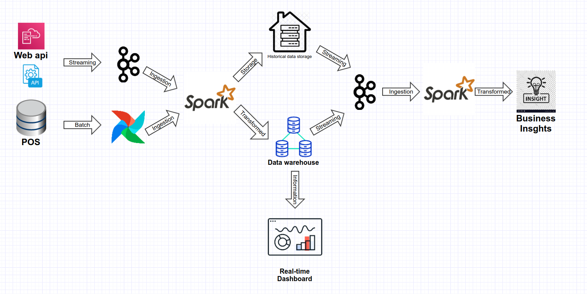

## Design Question

A Pizza Restaurant chain “Pizza House” has more than 2000 stores across the country. Each store manages its own inventory of raw materials. Each store prepares pizzas, side dishes, etc. and sells them along with ready to eat products such as cookies, drinks, etc. The sale can happen by Point of Sale (POS) or Online. The online transactions would be flowing in real time whereas the transactions made by POS can be synced every 15 minutes in batches. They offer pick-up and deliveries by 3rd party providers. 

At the head office of the restaurant chain, management is concerned with the logistics of ordering, stocking and selling products while maximizing profits as well as understanding their marketing & communications. Several promotional schemes such as temporary price reductions, ads in newspapers, displays etc., also keep rising. Considering the huge data volumes (hundreds of GB per month) and the variety of the data they have; management wants the architecture to be robust enough to handle the varying data loads. 

Design a cloud data platform to process and deliver insights based on the above. Please provide a high level solution design for the architecture. Feel free to choose any cloud provider you want.

### Requirements

1. Handle large write volume: Billions of write events per day.
2. Handle large read/query volume: Millions of merchants wish to gain insight into their business. Read/Query patterns are time-series related metrics.
3. Provide metrics to customers with at most one hour delay.
4. Run with minimum downtime.
5. Have the ability to reprocess historical data in case of bugs in the processing logic.

# Architecture diagram:

# <i>Data Ingestion</i>
The critical part of the architected solution is a robust, fault-tolerant and easily scalable data collection for both real-time and batch integrated, using Apache Kafka for real-time transactions and Apache Airflow for integrated batches.

## Streaming Data:
The stream of data from the online portal's API will be consumed using Apache Kafka and pushed to a spark cluster, as well as consuming the transformed data and pushing to the chosen data warehouse (BigQuery, Redshift, Azure Synapse).

## POS Data synchronization:
The pos transaction are stored in a local database and can be synced using Airflow. Airflow can also be use to orchestrate the data transformation, data cleaning, data validation and reprocessing historical data if necessary.

# <i>Data Transformation</i>
Using Spark to normalize the data and converting the different keys and values to their respective associated forms, writing the output to multiple destination data warehouses, storage for historical data.

# <i>Historical data</i>
Storing the transformed data for historical analysis can amplify the insights gain from the data.  

# <i>Analytics</i>
The transformed data is streamed to a data warehouse and its leverage to provide real-time insights on a dashboard.

## <i>Handling Failure Cases</i>
Assuming that error and retries are inevitable on distributed systems, so building a solution that is fault-tolerant and resilient is essential.
To deal with a failed transaction after a certain number of retries we can use a specific retry topic in Kafka or a specific branch in Airflow that will have the paradigma to deal with that failure.
Airflow can also orchestrate reprocessing of historical data if necessary.